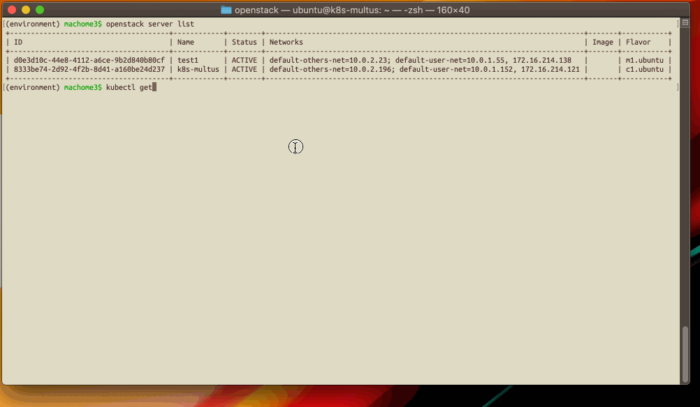

# Kubernetes + Multus CNI on OpenStack Demo

## About the Demo Environment

* OpenStack
* Open the Required Ports for Security Groups (6443/tcp 30000-32767/tcp etc ...)
* Run Kubernetes 1.18 on OpenStack Instance
* Using Multus CNI v3.6 as CNI
* Use Flannel or Canal as default CNI

## Information used for reference

* https://github.com/intel/multus-cni
* https://rheb.hatenablog.com/entry/multus_introduction